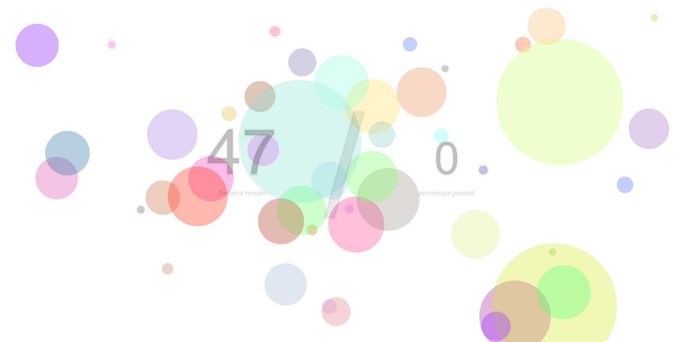
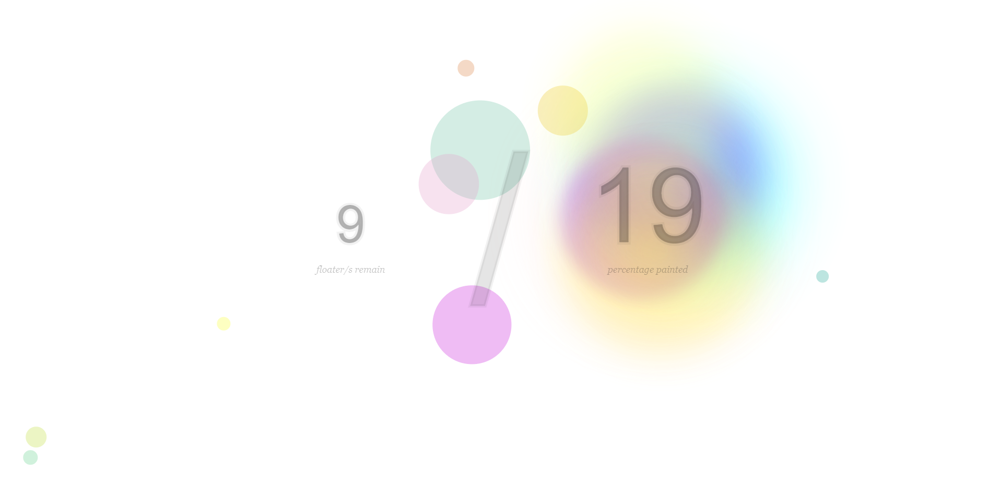

# [M01-Programming-Fundamentals](https://github.com/airenek-code/sdi-project-m01)

A NTU / SkillsUnion Software Developer Immersive sole individual project to showcase understanding and knowledge towards the fundamentals of Javascript.

For the first module, an original idea was conceived and developed to allow end users to _paint_ a blank canvas by clicking on floating objects that go across the screen. An alternative to playing this mini game includes merely popping the floating objects!

&nbsp;

## Hosted On:

https://airenek-code.github.io/sdi-project-m01/sdi-m01-js

&nbsp;

## Approaches Undertaken:

These are the approaches undertaken to ensure the success of the project, given the short development time of **_5 days_** and a desire to challenge oneself while utilizing domain knowledge.

&nbsp;

- Research for guides and tutorials to gauge **project feasibility**. First devise a scaled back alternative of the original idea or another backup plan, should milestones not be met after 1 - 1.5 days of development time.

- Prioritization will be on the most attainable features for a **minimum viable product** _(MVP)_ by project deadline. Understand which module/s may not succeed or take a longer time due to the lack of coding experience and available references given that this is an _original_ idea. For these module/s, development will commence with **proof of concept** _(POC)_ before actual implementation. This approach aids time saved, given the faster feedback. It also allows for the emergence of other possible workarounds upon the results obtained from the proof of concept - an example includes how the calculation of the canvas painted can be optimized by combining methods of approximation.

- An emphasis to focus on the appeal of the project using **design** and **aesthetics**. Henceforth, no efforts were spared in detailing this stage of the project. The factors considered for design includes:

&nbsp;

```

    (a) how interactivity can be achieved with the game design and UI of the scoring system

    (b) color palette used and the treatment of painted canvas

    (c) movement / directionality / scale / volume of floating objects and how it translates

```

&nbsp;

## Achievements:

```

1. Utilizing Vanilla Javascript for the creation of a mini game.

2. Application of fundamental topics such as:
Control Flow & Loops, Functions, Classes, Objects, OOP, Event Listeners, ECMAScript 2015 (ES6)

3. Experimenting with JS canvas and animation as these topics were not explored in fundamental classes.

4. Effective project scoping, planning, scheduling and problem-solving processes.


```

&nbsp;

This project was a tonne of fun from conceptualizing _how it might have worked_ to actually making it work!

It'll be heartening to know if the project outcome helps anyone to decompress a little or perhaps provide a form of distraction for kids with boundless energy!

&nbsp;

## Output:




&nbsp;

## Author:

- [Irene](https://github.com/airenek-code)

&nbsp;

## Built With:

- Javascript
- HTML
- CSS

&nbsp;

## References:

- https://developer.mozilla.org/en-US/docs/Web/API/Canvas_API
- https://www.geeksforgeeks.org/how-to-build-a-bounce-ball-with-html-and-javascript/
- https://www.youtube.com/watch?v=EO6OkltgudE&list=PLpPnRKq7eNW3We9VdCfx9fprhqXHwTPXL

&nbsp;
